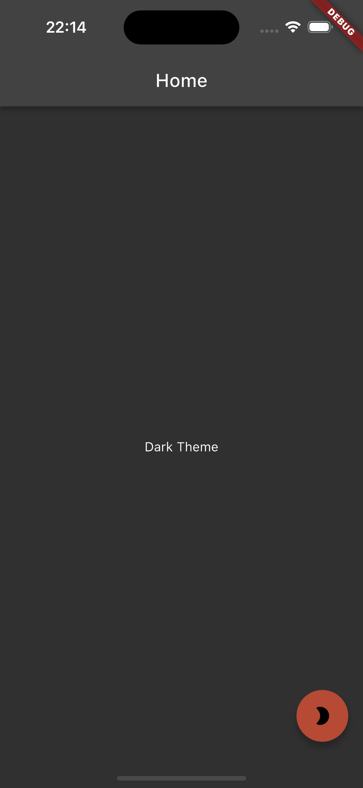
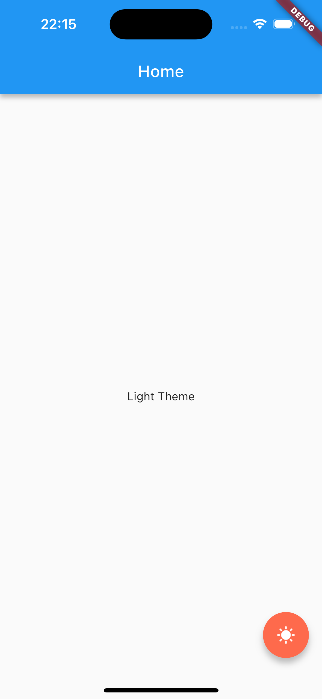

# FlutterPersistentTheme  

A lightweight Flutter project for implementing **theme switching** and **persistent theme storage** using [Hive](https://pub.dev/packages/hive).  

## ✨ Features  
- 🌗 Toggle between **Light** and **Dark** themes  
- 💾 Persist user-selected theme even after restarting the app  
- ⚡ Uses **Hive** for fast and efficient local storage  
- 🛠️ Simple and easy-to-integrate  

## 📸 Preview  




## 🚀 Getting Started  

### Installation  
Add the required dependencies to your **pubspec.yaml**:  

```yaml
dependencies:
  flutter:
    sdk: flutter
  hive: ^2.0.5
  hive_flutter: ^1.1.0
  path_provider: ^2.1.5
  flutter_riverpod: ^2.6.1
```

### Steps
- Setup Hive

    Initialize Hive in your main.dart:
    ```dart
    void main() async {
         WidgetsFlutterBinding.ensureInitialized();
        await Hive.initFlutter();
        var box = await Hive.openBox('settings');
        runApp(MyApp(box: box));
    }
    ```

- Implement Theme Switching

    Create a ThemeProvider to manage theme changes:
    ```dart
    final isDarkThemeProvider = StateProvider<bool>((ref) => false);
    ```

- Create a theme class to initialize and update the `isDarkThemeProvider` with the value stored in hive

    ```dart
    class ThemeClass extends ConsumerStatefulWidget {
        const ThemeClass({super.key, required this.child});

        final Widget child;

        @override
        ConsumerState<ThemeClass> createState() => _ThemeClassState();
    }

    class _ThemeClassState extends ConsumerState<ThemeClass> {
        bool initialized = false;
        late Box<dynamic> themeBox;

        @override
        void initState() {
            super.initState();
            initTheme();
        }

        void initTheme() async {
            try {
                themeBox = await Hive.openBox('theme');
                bool? isDarkTheme = themeBox.get('theme');

                if (isDarkTheme == null) {
                    initPersistentTheme();
                } else {
                    loadPersistentTheme(isDarkTheme);
                }
            } catch (e) {
                initPersistentTheme();
            }

            initialized = true;
            setState(() {});
        }

        initPersistentTheme() async {
            var box = Hive.box('theme');
            box.put('theme', false);
        }

        loadPersistentTheme(bool isDarkTheme) async {
            ref.read(isDarkThemeProvider.notifier).update((state) => isDarkTheme);
        }

        @override
        Widget build(BuildContext context) {
            return initialized == false ? const SizedBox() : widget.child;
        }
    }
    ```

- Create a handler function to store the `isDarkThemeProvider` value into Hive
    ```dart
    toggleTheme(bool value) async {
        final themeBox = await Hive.box('theme');
        bool? isDarkTheme = themeBox.get('theme');
        if (isDarkTheme != null) {
            themeBox.put('theme', value);
        }
    }
    ```

- wrap the MaterialApp with the ThemeClass
    ```dart
        Widget build(BuildContext context) {
            return ThemeClass(
                    child: GetMaterialApp(
                    title: 'Flutter Persistent Theme',
                    theme: ref.watch(themeProvider),
                    darkTheme: ref.watch(themeProvider),
                    home: const FlutterPersistentThemePage(),
                    ),
            );
        }
    ```
- Use the provider in your UI:
    ```dart
        Column(
            mainAxisAlignment: MainAxisAlignment.center,
            children: <Widget>[
                Text(ref.watch(isDarkThemeProvider) ? 'Dark Theme' : 'Light Theme')
            ],
            )
    ```
- Switching Theme with a Button
    ```dart
        FloatingActionButton(
            backgroundColor:
                ref.watch(isDarkThemeProvider) ? primaryColorDark : primaryColor,
            onPressed: () {
            bool isDarkTheme = ref.read(isDarkThemeProvider);
            ref.watch(isDarkThemeProvider.notifier).update((state) => !state);
            toggleTheme(!isDarkTheme);
            },
            child: ref.watch(isDarkThemeProvider)
                ? const Icon(Icons.mode_night_rounded)
                : const Icon(Icons.sunny),
        )
    ```
## 📌 Conclusion
FlutterPersistentTheme provides an easy way to implement theme switching and persistence in Flutter apps using Hive.

Feel free to ⭐ Star this repo if you find it useful!

